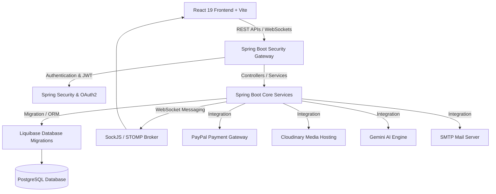

# 🏟️ D-Sport Center - Enterprise Online Sports Court Booking & Management System

[](https://jdk.java.net/21/)
[](https://spring.io/projects/spring-boot)
[](https://react.dev/)
[](https://vite.dev/)
[](https://tailwindcss.com/)
[](https://www.postgresql.org/)
[](https://www.docker.com/)
[](https://developer.paypal.com/)
[](https://deepmind.google/technologies/gemini/)
[](#-copyright--license)

> **Enterprise-grade, high-performance sports court booking and facility management system.** Engineered using a modern decoupled architecture with **Spring Boot 4** and **React 19**, featuring real-time availability checks, automated QR-ticket workflows, PayPal standard payment processing, Google Gemini AI assistant integration, and production-ready PostgreSQL migrations with Liquibase.

---

## 📝 Copyright & License

**© 2026 Nguyễn Tấn Thái Dương. All Rights Reserved.**

Any unauthorized copying, distribution, modification, or commercial exploitation of this source code without the prior written consent of the copyright owner (**Nguyễn Tấn Thái Dương**) is strictly prohibited.

---

## 🚀 Core Features

### 👤 Customer Features

- **Flexible Sports Court Booking:** Search and choose available courts, select desired time slots, and view real-time reservation schedules on an interactive calendar grid.
- **Dynamic Guest Booking Cart:** Seamlessly queue multiple court bookings for rapid checkout. State transitions, pricing, and timing configurations update instantly without scroll-locking.
- **Optional Email Checkout for Walk-in Guests:** Allows walk-in or guest bookings to proceed directly with only a Name and Phone Number, removing the friction of a mandatory email address and maximizing front-counter booking speeds.
- **Smart PayPal SDK Integration:** Fully integrated international payment processing using the native PayPal Smart Checkout SDK (Sandbox and Live environments) with secure server-side capture verification.
- **Automated QR Code Tickets:** Generates unique QR-coded check-in passes instantly upon successful reservations, accompanied by clean transactional confirmation emails.
- **Gemini AI Chat Assistant:** Interact with an intelligent chatbot powered by the `gemini-2.0-flash` model, retrieving real-time court schedules, price ranges, and smart slot recommendations.
- **Interactive Review & Rating System:** Customers can leave star ratings and comprehensive written feedback directly on individual court profile pages.
- **Multi-Platform OAuth2 Sign-In:** One-tap, passwordless user registration and login utilizing secure Google and Facebook social auth flows.

### 💼 Admin & Staff Features

- **Data-Driven Analytics Dashboard:** Real-time metrics tracking total revenue, booking counts, user activity, and seasonal trends via responsive, interactive charts built with Recharts.
- **Professional Enterprise Excel Reports (.XLSX):** Programmatic spreadsheet rendering with **SheetJS**, formatting numbers, generating proper currency columns, auto-adjusting column widths to completely eliminate truncated `###` layout issues, and writing dynamic native `=SUM(...)` formulas directly into sheets.
- **Robust Reservation Lifecycle Management:** Monitor, update, and manage all scheduling states (Pending, Confirmed, Completed, Cancelled) with structured audit records.
- **Staff QR Check-in Camera Application:** Specialized mobile-friendly camera interface using WebRTC, providing immediate scan decoding and comprehensive validation warnings via custom centralized exceptions (`AppException`).
- **High-Performance Time Overlap Prevention:** Advanced mathematical scheduling algorithm protecting database records from double-booking. Slots are guaranteed via standard boundary overlaps:
  $$\text{Overlap} \iff (\text{BookingStart} < \text{RequestedEnd}) \land (\text{BookingEnd} > \text{RequestedStart})$$
- **Review Moderation Portal:** Clean, quick-toggle management tools enabling administrators to easily hide or show reviews to preserve platform integrity.
- **Real-Time WebSocket Push Alerts:** Dashboards update instantly with live audio-visual notifications on incoming bookings or status updates via persistent STOMP brokers.
- **Optimized High-Contrast Alert Interface:** Frosted-glass components are customized with maximum contrast to ensure high readability across both Light and Dark themes. Features safe instantaneous transaction clearing (`flush()`) to eliminate stale notifications when users reload the page (F5).

---

## 🛠️ Technology Stack

### 🖥️ Backend Framework (Spring Boot 4.0.2 & Java 21)

- **Language & Runtime:** Java 21 (JDK 21) with modern pattern matching and virtual thread compatibility.
- **Core Framework:** Spring Boot 4.0.2 with Spring Core, Web, and WebSocket starters.
- **Security & Session Management:** Spring Security, stateless Nimbus JOSE JWT (JSON Web Tokens), and OAuth2 Client integrations.
- **Persistence Layer:** PostgreSQL with Spring Data JPA and Hibernate (configured to strict `validate` mode in production).
- **Database Migration & Schema Control:** **Liquibase Core** for professional source-controlled schema versions, utilizing SQL changesets (e.g., `009-make-guest-email-nullable.sql`) for database updates.
- **Entity & DTO Mapping:** MapStruct + Lombok for compile-time safe, high-performance mapper architectures.
- **Third-Party Integrations:**
  - **PayPal REST API (v2)** for secure invoice capture.
  - **Cloudinary SDK** for remote media storage, image resizing, and CDN optimization.
  - **JavaMailSender (SMTP)** for processing automated confirmation templates with embedded attachments.
  - **Google Gemini API** (`gemini-2.0-flash`) leveraging real-time database contexts for low-latency context-aware customer queries.

### 🎨 Frontend Framework (React 19 & Vite 8)

- **Application Engine:** React 19 leveraging the React Compiler, paired with Vite 8 for hot module replacement (HMR) and optimized build bundling.
- **Global State Management:** Redux Toolkit (`@reduxjs/toolkit` and `react-redux`) for structured state-slice synchronization.
- **Asynchronous Server State:** TanStack React Query v5 for advanced client-side API caching, optimistic updates, and invalidation.
- **Spreadsheet Generation:** **SheetJS (xlsx)** for constructing complex multi-sheet Excel workbooks client-side.
- **Styling & UI/UX System:**
  - **Tailwind CSS v4** utility classes for highly performant styling.
  - **Shadcn UI & Radix UI** headless primitives ensuring maximum Web Accessibility Initiative (WAI-ARIA) compliance.
  - **Lucide React & FontAwesome** for standard UI iconography.
- **Hardware Integration & QR Generation:** `@yudiel/react-qr-scanner` for scanning camera control, paired with `qrcode.react` for vector QR ticket generation.
- **Client Payment Controls:** `@paypal/react-paypal-js` for rendering responsive PayPal Smart Payment buttons.

---

## 📐 System Architecture



---

## 🗂️ Project Directory Structure

```text
sports-center/
├── be/                       # Backend Spring Boot Project
│   ├── src/main/java/com/devduong/be/
│   │   ├── controllers/      # REST API Controllers (endpoints)
│   │   ├── services/         # Business Logic (AIChatService, CourtService, BookingService,...)
│   │   ├── repositories/     # Spring Data JPA Repositories
│   │   ├── entities/         # JPA Entities (User, Court, Booking, Review,...)
│   │   ├── dtos/             # Data Transfer Objects (request/response models)
│   │   └── config/           # Security, WebSocket, PayPal, Cloudinary Config
│   └── src/main/resources/
│       ├── application.yml   # Spring Boot Configuration File
│       └── db/changelog/     # Liquibase Database Migrations & Change Master
├── fe/                       # Frontend React Project
│   ├── src/
│   │   ├── components/       # Reusable UI components (AIChatWidget, Layout,...)
│   │   ├── pages/            # View Pages (admin/CourtsPage, user/BookingPage,...)
│   │   ├── redux/            # Redux Toolkit Slices (auth, cart,...)
│   │   └── hooks/            # Custom React Hooks & React Query queries/mutations
│   ├── package.json          # Frontend dependencies & scripts
│   └── vite.config.js        # Vite compilation rules
├── docker-compose.yml        # Docker Orchestration Configuration (PostgreSQL setup)
└── README.md                 # Project Overview & Setup Instructions
```

---

## ⚙️ Installation & Configuration

### 📌 Prerequisites

Before running the application, ensure the following software is installed on your local environment:
- **Java Development Kit (JDK) 21**
- **Node.js 18+ & npm 9+**
- **Docker & Docker Desktop** (Recommended for local database hosting)
- **PostgreSQL 16+** (If running natively without Docker containers)

---

### 1️⃣ Setting Up Environment Variables

#### 📂 Backend Configuration (`be/.env`)
Create a file named `.env` in the `be/` directory and configure the environment variables as follows:

```env
# Database Credentials
DATASOURCE_URL=jdbc:postgresql://localhost:5432/sportsdb
DATASOURCE_USERNAME=postgres
DATASOURCE_PASSWORD=root

# Social Login Authentication (Google & Facebook Developer Consoles)
GOOGLE_CLIENT_ID=your_google_client_id
GOOGLE_CLIENT_SECRET=your_google_client_secret
FACEBOOK_CLIENT_ID=your_facebook_client_id
FACEBOOK_CLIENT_SECRET=your_facebook_client_secret

# SMTP Email Dispatch Server Configuration (Gmail App Password recommended)
MAIL_HOST=smtp.gmail.com
MAIL_PORT=587
MAIL_USERNAME=your_email@gmail.com
MAIL_PASSWORD=your_email_app_password

# Cloudinary Cloud Storage Credentials
CLOUDINARY_CLOUD_NAME=your_cloud_name
CLOUDINARY_API_KEY=your_cloudinary_api_key
CLOUDINARY_API_SECRET=your_cloudinary_api_secret

# PayPal Sandbox / Live Merchant APIs
PAYPAL_CLIENT_ID=your_paypal_client_id
PAYPAL_CLIENT_SECRET=your_paypal_client_secret

# Google Gemini Core Engine API Key
GEMINI_API_KEY=your_gemini_api_key
```

#### 📂 Frontend Configuration (`fe/.env`)
Create a file named `.env` in the `fe/` directory to configure the frontend API and socket gateways:

```env
VITE_API_BASE_URL=http://localhost:8080
VITE_WS_BASE_URL=ws://localhost:8080/ws
VITE_PAYPAL_CLIENT_ID=your_paypal_client_id
```

---

### 2️⃣ Launching the Application Locally

#### Option A: Quick Orchestration via Docker Compose (Recommended)
1. Launch **Docker Desktop**.
2. Navigate to the root directory containing the `docker-compose.yml` file.
3. Run the orchestration build command:
   ```bash
   docker-compose up --build
   ```
4. This command automatically packages the spring backend application, maps environment parameters, boots the PostgreSQL container, and links standard ports.

#### Option B: Individual Service Boot (Manual)

**Step 1: Start the PostgreSQL Database Container**
Spin up an isolated PostgreSQL instance using a public Docker container:
```bash
docker run --name sports-db -e POSTGRES_DB=sportsdb -e POSTGRES_USER=postgres -e POSTGRES_PASSWORD=root -p 5432:5432 -d postgres:16-alpine
```

**Step 2: Initialize & Launch the Spring Boot Backend**
1. Open a new terminal in the `be/` directory.
2. Package dependencies and compile class structures:
   ```bash
   ./mvnw clean install
   ```
3. Run the Spring Boot development server:
   ```bash
   ./mvnw spring-boot:run
   ```
   *Note: On boot, **Liquibase** executes automatically to run missing changesets and set up the schema structure.*

**Step 3: Initialize & Launch the React Frontend**
1. Open a new terminal in the `fe/` directory.
2. Install npm dependency packages:
   ```bash
   npm install
   ```
3. Run the Vite local development compilation:
   ```bash
   npm run dev
   ```
4. Access the web interface in your browser at: `http://localhost:5173`.

---

## 🔒 Production Deployment Guidelines

When transitioning this platform into a production hosting environment, strictly adhere to the following enterprise configuration rules:

1. **Secure Environment Parameters:** Never commit configuration files containing private credentials (`.env`) to public repositories. Leverage secure storage managers like **Docker Secrets**, **AWS Secrets Manager**, or environment dashboard panels in PaaS services (e.g., Render, Railway, AWS ECS).
2. **Reverse Proxy (Nginx Architecture):** Deploy Nginx as a reverse proxy in front of both the API Gateway (port `8080`) and the React build outputs (statically packaged under the `/dist` directory).
3. **Upgrade WebSocket Headers:** Ensure Nginx is configured to properly upgrade headers to support WebSockets. The proxy block must contain:
   ```nginx
   proxy_set_header Upgrade $http_upgrade;
   proxy_set_header Connection "upgrade";
   ```
4. **Strict Schema Validations:** Ensure `spring.jpa.hibernate.ddl-auto` remains set to `validate` in the production environment profile (`application.yml`). All table modifications must be safely applied via structured **Liquibase Changeset XMLs**.
5. **Secure SSL/TLS Certifications:** Bind public domains with active SSL/TLS certificates (e.g., Let's Encrypt / Certbot). This is a strict requirement for secure Google OAuth2 login callbacks and PayPal capture webhooks.

---

## 🏢 Author & Contributor Details

- **Author & Developer:** **Nguyễn Tấn Thái Dương**
- **GitHub Profile:** [@DuongGB](https://github.com/DuongGB)
- **Role:** Fullstack Software Engineer / Tech Lead
