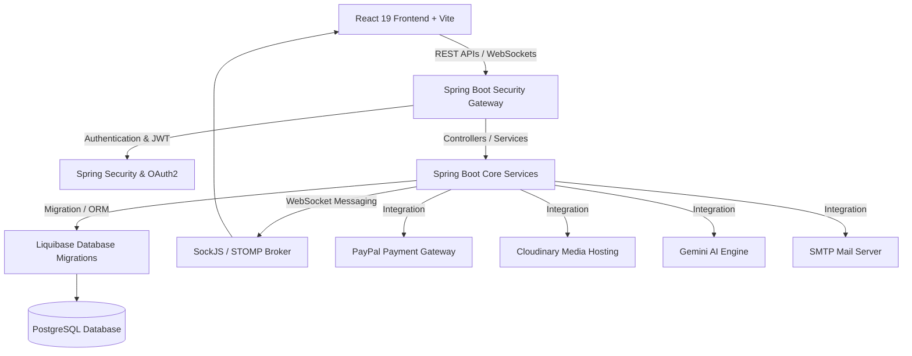

# D-Sport Center - Hệ Thống Quản Lý & Đặt Lịch Sân Thể Thao Trực Tuyến

> **Hệ thống quản lý và đặt lịch sân thể thao chuẩn Enterprise.** Tích hợp thanh toán trực tuyến, thông báo thời gian thực, quét mã QR check-in, AI hỗ trợ thông minh và kiến trúc Spring Boot 4 + React 19 tối tân.

---

## 📝 Bản Quyền Sở Hữu (Copyright & License)

**© 2026 Nguyễn Tấn Thái Dương.**

Mọi hành vi sao chép, phân phối hoặc sửa đổi mã nguồn mà không có sự cho phép bằng văn bản từ tác giả **Nguyễn Tấn Thái Dương**

---

## 🚀 Tính Năng Nổi Bật (Core Features)

### 👤 Cho Khách Hàng (User Features)

- **Đặt Lịch Sân Thể Thao Linh Hoạt:** Chọn sân, thời gian và xem các khung giờ trống theo thời gian thực (Real-time court slots).
- **Giỏ Hàng Đặt Sân Tạm Thời (Guest Booking Cart):** Quản lý giỏ hàng đặt sân cho khách vãng lai mượt mà, đồng bộ trạng thái thanh toán và check-out tự động mà không bị khóa cuộn trang (scroll-locking).
- **Đặt Sân Khách Vãng Lai Không Bắt Buộc Email:** Cho phép đặt sân nhanh cho khách vãng lai mà không bắt buộc điền Email (chỉ cần Họ tên và Số điện thoại), tối ưu hóa trải nghiệm người dùng nhanh chóng.
- **Thanh Toán PayPal Thông Minh:** Tích hợp cổng thanh toán quốc tế PayPal với SDK Checkout (Sandbox/Live) bảo mật tuyệt đối.
- **Quét Mã QR Check-in Tiện Lợi:** Nhận vé và mã QR cho mỗi lần đặt lịch thành công, hỗ trợ check-in siêu tốc khi đến sân.
- **Trò Chuyện Cùng Trợ Lý Gemini AI:** Hỗ trợ tư vấn đặt sân, đề xuất khung giờ phù hợp dựa trên mô hình `gemini-2.0-flash` tiên tiến.
- **Hệ Thống Đánh Giá & Phản Hồi:** Khách hàng đánh giá chất lượng dịch vụ, tương tác trực tiếp qua hệ thống Reviews.
- **Đăng Nhập Đa Nền Tảng (OAuth2):** Đăng nhập nhanh qua Google hoặc Facebook tiện lợi, an toàn.

### 💼 Cho Ban Quản Trị & Nhân Viên (Admin & Staff Features)

- **Bảng Điều Khiển Tổng Quan (Dashboard Analytics):** Thống kê doanh thu, số lượt đặt sân, biểu đồ phân tích trực quan qua Recharts.
- **Xuất Báo Cáo Excel Chuyên Nghiệp (.XLSX):** Tích hợp SheetJS xuất trực tiếp tệp tin `.xlsx` chuẩn doanh nghiệp, dữ liệu cột tiền tệ định dạng số thực tế, tự động giãn độ rộng cột chống lỗi hiển thị `###`, và tích hợp công thức `=SUM(...)` động tính toán trực tiếp trên Excel.
- **Quản Lý Đặt Lịch (Bookings Management):** Quản lý trạng thái đơn đặt lịch, xác nhận, hủy và xem lịch sử chi tiết.
- **Hệ Thống Check-in QR Staff:** Nhân viên quét mã QR check-in của khách ngay tại quầy bằng camera với phản hồi lỗi chi tiết, trực quan (`AppException`).
- **Tránh Trùng Lịch Sự Kiện:** Giải thuật kiểm tra xung đột thời gian (Time Overlap Validation) ngăn chặn việc xếp lịch trùng lặp.
- **Kiểm Duyệt Review:** Quản trị viên dễ dàng ẩn/hiện các đánh giá để đảm bảo chất lượng thông tin hiển thị.
- **Thông Báo Thời Gian Thực (Real-time Notifications):** Nhận thông báo ngay lập tức qua WebSocket khi có booking mới hoặc thay đổi trạng thái sân.
- **Giao Diện Thông Báo Sắc Nét & Lưu Trữ Đồng Bộ:** Tối ưu tương phản tuyệt đối cho thông báo ở cả Dark/Light mode, khắc phục hiện tượng mờ nhạt trên nền kính mờ; cơ chế xóa thông báo tức thời đồng bộ giao dịch (`flush()`) triệt tiêu lỗi hiển thị lại thông báo khi làm mới trang (F5).

---

## 🛠️ Công Nghệ Sử Dụng (Tech Stack)

### 🖥️ Backend (Spring Boot 4.0.2 & Java 21)

- **Framework Chính:** Spring Boot 4.0.2, Java 21 (JDK 21) tối ưu hiệu năng cao.
- **Bảo Mật & Xác Thực:** Spring Security, Nimbus JOSE JWT (JSON Web Tokens), OAuth2 Client (Google & Facebook).
- **Cơ Sở Dữ Liệu & ORM:** PostgreSQL & Spring Data JPA (ddl-auto: `validate` cho production).
- **Migration & Quản Lý Schema:** Liquibase Core giúp kiểm soát phiên bản database chuyên nghiệp, giải quyết hạ ràng buộc `NOT NULL` bằng SQL changeset (`009-make-guest-email-nullable.sql`).
- **Ánh Xạ Đối Tượng (DTO Mapping):** MapStruct + Lombok giúp viết code sạch và tối giản.
- **Giao Tiếp Thời Gian Thực:** Spring WebSocket (STOMP Broker & SockJS client).
- **Tích Hợp Dịch Vụ Thứ Ba:**
  - **PayPal SDK Checkout (v2)** cho cổng thanh toán.
  - **Cloudinary SDK** quản lý và tối ưu hóa hình ảnh.
  - **JavaMailSender** tự động gửi mail xác nhận booking và QR code.
  - **Google Gemini API** (`gemini-2.0-flash`) tích hợp trợ lý AI.

### 🎨 Frontend (React 19 & Vite 8)

- **Framework:** React 19, Vite 8 (Hot Module Replacement siêu tốc).
- **Quản Lý Trạng Thái:** Redux Toolkit (`@reduxjs/toolkit` & `react-redux`).
- **Quản Lý Dữ Liệu & Caching:** TanStack React Query v5 giảm thiểu tối đa các API calls trùng lặp, tối ưu caching.
- **Xuất Bản Spreadsheets:** **SheetJS (xlsx)** cấu trúc xuất dữ liệu, định dạng hiển thị, gộp ô và xử lý công thức Excel.
- **Giao Diện & UI/UX:**
  - Tailwind CSS v4 mới nhất.
  - Shadcn UI & Radix UI cho các components chuẩn accessible, mượt mà.
  - Lucide React & FontAwesome Icons.
- **Quét & Tạo Mã QR:** `@yudiel/react-qr-scanner` & `qrcode.react`.
- **Thanh Toán Client:** `@paypal/react-paypal-js`.

---

## 📐 Kiến Trúc Hệ Thống (System Architecture)



---

## ⚙️ Hướng Dẫn Cài Đặt (Setup & Configuration)

### 📌 Yêu Cầu Hệ Thống (Prerequisites)

- **Java Development Kit (JDK) 21**
- **Node.js 18+ & npm 9+**
- **Docker & Docker Compose** (Khuyên dùng để triển khai nhanh)
- **Cơ sở dữ liệu PostgreSQL** (Nếu chạy độc lập không qua Docker)

---

### 1️⃣ Cấu Hình Biến Môi Trường (Environment Variables)

#### 📂 Backend (`be/.env`)

Tạo file `.env` tại thư mục `be/` và điền đầy đủ các thông tin cấu hình sau:

```env
# Database Configuration
DATASOURCE_URL=jdbc:postgresql://localhost:5432/sportsdb
DATASOURCE_USERNAME=postgres
DATASOURCE_PASSWORD=root

# Social Login (Google & Facebook)
GOOGLE_CLIENT_ID=your_google_client_id
GOOGLE_CLIENT_SECRET=your_google_client_secret
FACEBOOK_CLIENT_ID=your_facebook_client_id
FACEBOOK_CLIENT_SECRET=your_facebook_client_secret

# Mail Configuration
MAIL_HOST=smtp.gmail.com
MAIL_PORT=587
MAIL_USERNAME=your_email@gmail.com
MAIL_PASSWORD=your_email_app_password

# Cloudinary Storage
CLOUDINARY_CLOUD_NAME=your_cloud_name
CLOUDINARY_API_KEY=your_cloudinary_api_key
CLOUDINARY_API_SECRET=your_cloudinary_api_secret

# PayPal Gateway
PAYPAL_CLIENT_ID=your_paypal_client_id
PAYPAL_CLIENT_SECRET=your_paypal_client_secret

# Google Gemini AI Key
GEMINI_API_KEY=your_gemini_api_key
```

#### 📂 Frontend (`fe/.env`)

Tạo file `.env` tại thư mục `fe/` để cấu hình API endpoints:

```env
VITE_API_BASE_URL=http://localhost:8080
VITE_WS_BASE_URL=ws://localhost:8080/ws
VITE_PAYPAL_CLIENT_ID=your_paypal_client_id
```

---

### 2️⃣ Khởi Chạy Ứng Dụng (Running Locally)

#### Cách A: Sử dụng Docker Compose (Nhanh & Chuẩn Hóa Nhất)

1. Đảm bảo Docker Desktop đã khởi chạy.
2. Tại thư mục gốc dự án (chứa file `docker-compose.yml`), chạy lệnh:
   ```bash
   docker-compose up --build
   ```
3. Hệ thống sẽ tự động build image cho cả backend và khởi chạy container PostgreSQL cùng lúc.

#### Cách B: Chạy thủ công từng phần

**Khởi chạy Cơ sở dữ liệu (PostgreSQL):**
Khởi chạy một instance Postgres độc lập qua Docker:

```bash
docker run --name sports-db -e POSTGRES_DB=sportsdb -e POSTGRES_USER=postgres -e POSTGRES_PASSWORD=root -p 5432:5432 -d postgres:16-alpine
```

**Khởi chạy Backend (Spring Boot):**

1. Mở terminal tại thư mục `be/`.
2. Build và tải các dependencies:
   ```bash
   ./mvnw clean install
   ```
3. Khởi chạy ứng dụng:
   ```bash
   ./mvnw spring-boot:run
   ```
   _Lưu ý: Liquibase sẽ tự động chạy và khởi tạo toàn bộ cấu trúc bảng cơ sở dữ liệu._

**Khởi chạy Frontend (React + Vite):**

1. Mở terminal tại thư mục `fe/`.
2. Cài đặt các gói thư viện:
   ```bash
   npm install
   ```
3. Khởi chạy môi trường phát triển:
   ```bash
   npm run dev
   ```
4. Truy cập giao diện ứng dụng tại: `http://localhost:5173`.

---

## 🔒 Triển Khai Sản Xuất (Production Deployment Guidelines)

1. **Bảo Mật Biến Môi Trường:** Tuyệt đối không commit các file chứa khoá bảo mật (`.env`) lên kho lưu trữ Git công khai. Sử dụng Docker Secrets, AWS Secrets Manager, hoặc trang quản trị biến môi trường của nhà cung cấp PaaS (Render, Fly.io, Railway, AWS).
2. **Cấu Hình Reverse Proxy (Nginx):** Cấu hình Nginx làm Proxy ngược cho cả API Spring Boot (cổng 8080) và React App (đã được build tĩnh ra thư mục `dist`).
3. **Cấu Cấu Hình Cập Nhật Kết Nối (WebSocket Upgrade):** Đảm bảo cấu hình Nginx cho phép duy trì kết nối WebSocket bằng cách nâng cấp headers:
   ```nginx
   proxy_set_header Upgrade $http_upgrade;
   proxy_set_header Connection "upgrade";
   ```
4. **Cơ Sở Dữ Liệu:** Đảm bảo `spring.jpa.hibernate.ddl-auto` luôn đặt là `validate` (đã cấu hình sẵn trong `application.yml`) để giữ tính toàn vẹn của dữ liệu sản xuất. Mọi thay đổi về cấu trúc bảng phải được cập nhật qua Liquibase changeset.
5. **Chứng Chỉ Bảo Mật SSL/TLS:** Đăng ký chứng chỉ bảo mật HTTPS (ví dụ qua Let's Encrypt) cho domain của bạn để đảm bảo API PayPal và OAuth2 hoạt động ổn định và bảo mật.

---

## 🏢 Thông Tin Tác Giả & Sở Hữu Trí Tuệ (Author)

- **Tác Giả & Nhà Phát Triển:** **Nguyễn Tấn Thái Dương**
- **Github Profile:** [DuongGB](https://github.com/DuongGB)
- **Vị Trí:** Fullstack Software Engineer / Tech Lead
- **Bản quyền sản phẩm:** **Nguyễn Tấn Thái Dương**.
